# Snowflake → ClickHouse Cloud: End-to-End AI-Assisted Migration Demo

A complete walkthrough of an AI agent moving a TPC-H workload — augmented with
Snowflake-specific features (VARIANT, TIMESTAMP_TZ, Stream, Dynamic Table,
Clustering Key) — out of Snowflake and into ClickHouse Cloud in eight steps,
all driven from a chat interface.

The agent has live connections to the source Snowflake account and the
target ClickHouse Cloud service. It discovers the source schema dynamically
— no hardcoded knowledge of the workload — and makes its own decisions
about type mappings, materialization patterns, and Snowflake-only features
that don't translate cleanly.

> Setup steps are in [GUIDE.md](GUIDE.md). The 8 sections below correspond
> 1:1 to the prompts a partner sends during the migration itself.

---

## Step 1 — Schema Discovery

> *"Inventory the source Snowflake account and produce a migration inventory."*

The agent enumerates databases, schemas, tables, views, and Snowflake-only
objects (Streams, Tasks, Dynamic Tables, Materialized Views, Iceberg Tables).
It captures column types, NULL frequency, and distinct-value counts, then
produces a **Migration Planning Report** as a side-panel artifact
summarising challenges and recommended resolutions.

In this run the agent flagged the source's Stream (`ORDERS_CDC`, no direct
ClickHouse equivalent), Dynamic Table (`DAILY_ORDER_SUMMARY`, translatable to
an AggregatingMergeTree MV), VARIANT column (`ORDERS.ORDER_METADATA`,
mappable to ClickHouse JSON), and Clustering Key on LINEITEM (mappable to
ORDER BY).

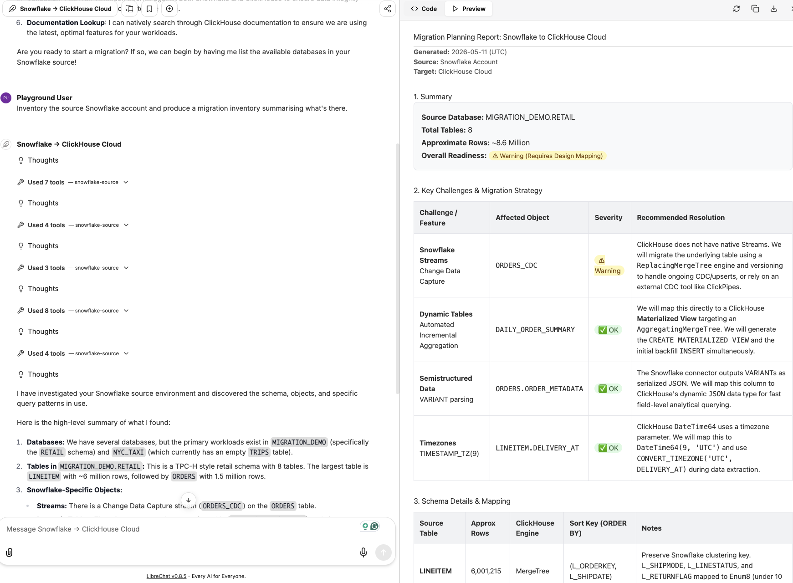

---

## Step 2 — Query Pattern Analysis

> *Paste the sample analytical queries; ask the agent to derive ORDER BY and
> partition recommendations from the columns that appear in WHERE / JOIN /
> GROUP BY.*

The agent inspects each query's filter, join, and group-by columns and
proposes ordering keys per table — choosing low-cardinality columns first
to maximise granule skipping, picking a date or timestamp as the secondary
key for time-range pruning, and recommending `LowCardinality(String)` for
neighborhood-style dimensions.

For the augmented columns it recommends type-specific changes:
* `LINEITEM.DELIVERY_AT` (Snowflake `TIMESTAMP_TZ`) → ClickHouse
  `DateTime64(3, 'UTC')` with a `CONVERT_TIMEZONE('UTC', …)` step.
* `ORDERS.ORDER_METADATA` (Snowflake `VARIANT`) → ClickHouse `JSON`, with
  hot keys (`payment_method`, `customer_segment`) potentially promoted to
  typed columns later.

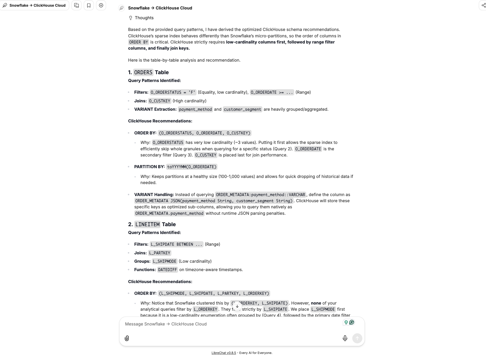

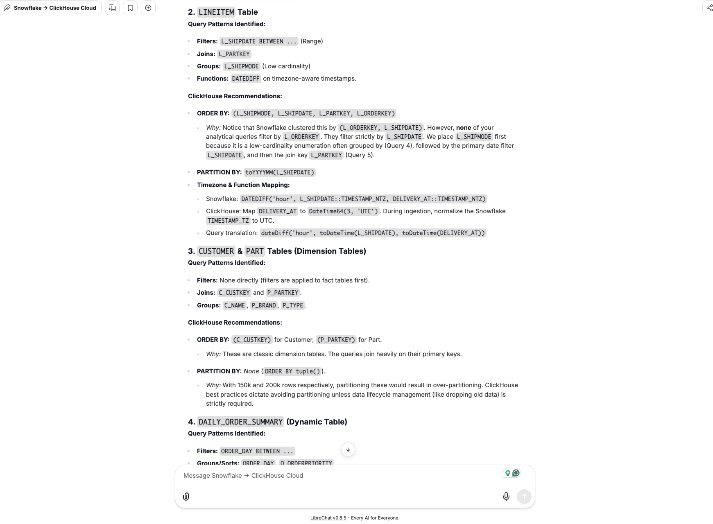

---

## Step 3 — Schema Design and Implementation

> *"Implement the ClickHouse target schema."*

The agent generates the full `CREATE TABLE` DDL for all 8 dimensions and
fact tables plus the Materialized View that replaces the Snowflake
Dynamic Table. Highlights:

* Monetary columns use `Decimal(P, S)` (not `Float`) to preserve precision
  on cumulative sums.
* `LowCardinality(String)` is applied to repeated text fields (e.g.
  `c_mktsegment`, `l_shipmode`, `o_orderpriority`).
* The Dynamic Table becomes a ClickHouse `AggregatingMergeTree` target
  with an attached Materialized View triggered by `INSERT`s into `orders`.
* The agent **presents every DDL statement and waits for explicit
  confirmation** before applying it to ClickHouse Cloud — a guardrail
  against accidental schema changes.

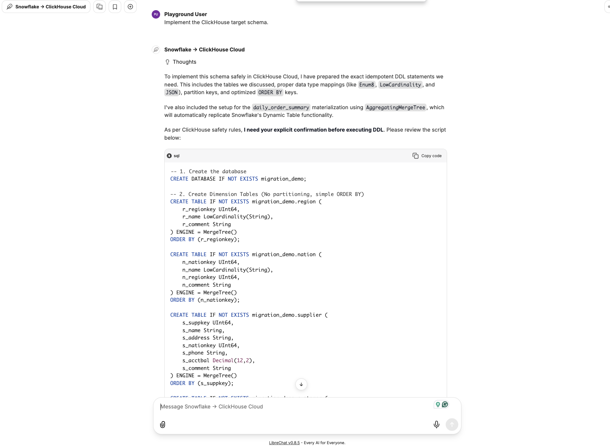

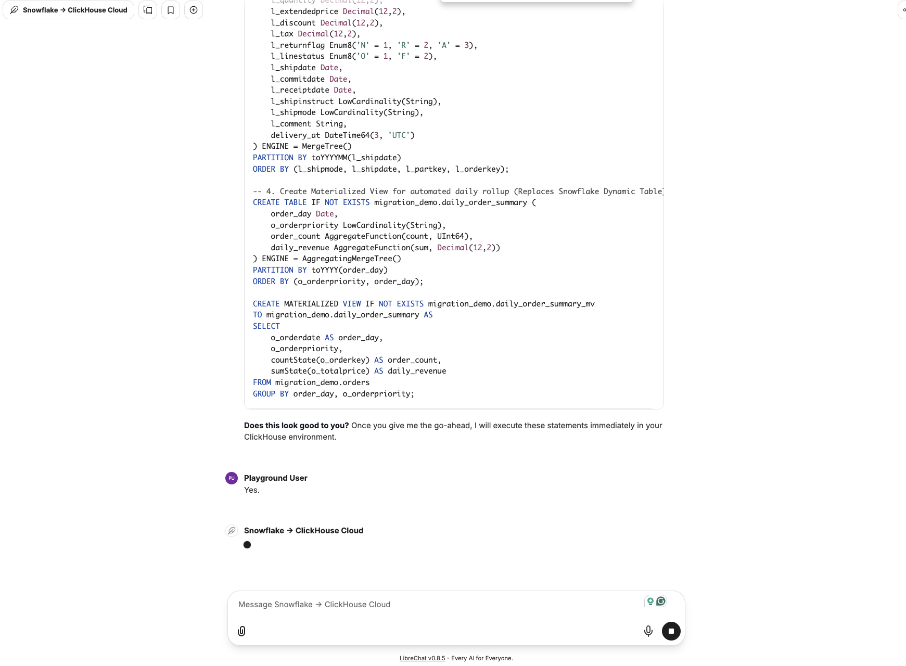

---

## Step 4 — Data Migration

> *"Migrate data from Snowflake to ClickHouse Cloud with a Python script.
> Check the data count at the end of migration."*

The agent writes a migration script that reads from Snowflake, casts each
column to the right ClickHouse type, and inserts in batched chunks. The
script runs directly inside the chat — partners watch real-time progress
("Migrating LINEITEM…", "Inserted 1,100,000 rows…") stream in as the
migration progresses, without leaving the conversation or touching a
local editor.

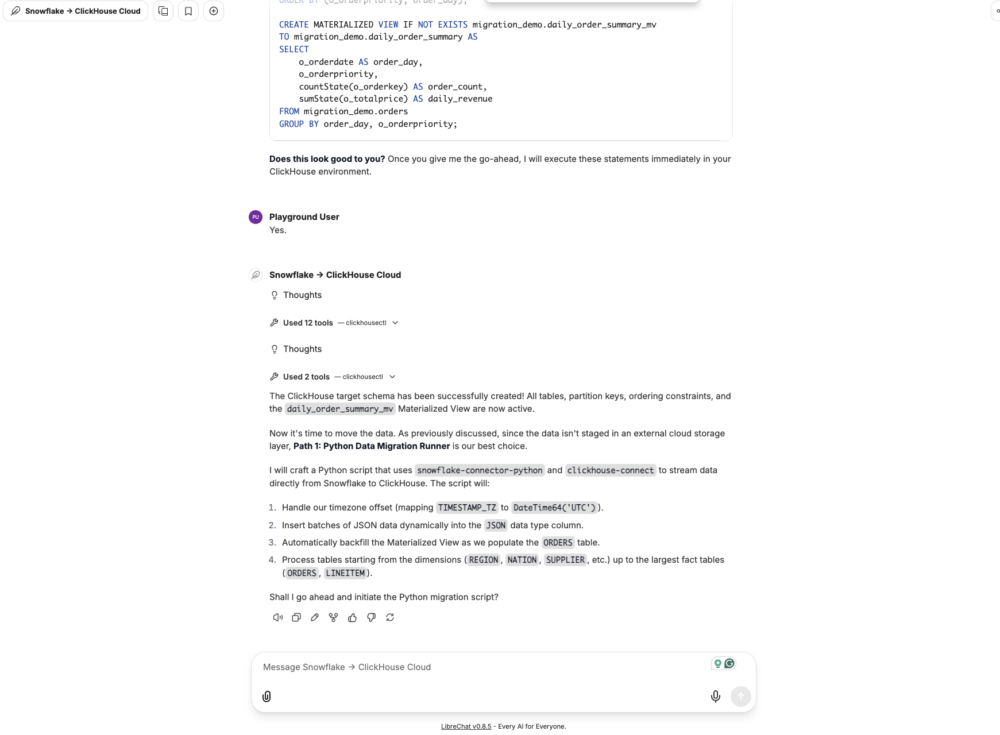

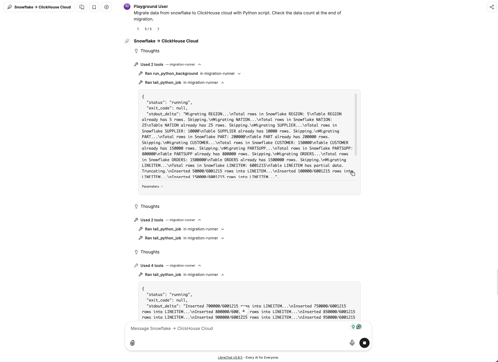

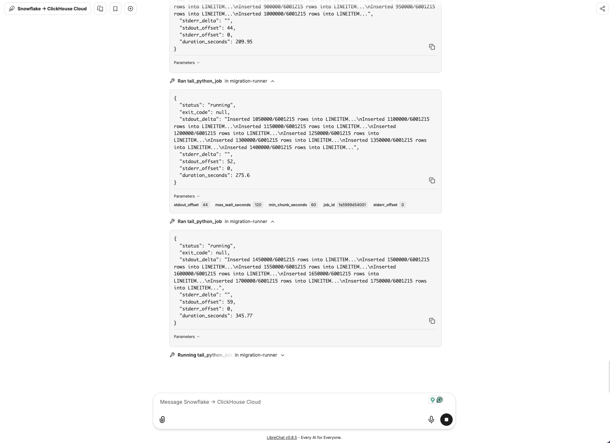

---

## Step 5 — Query Rewriting

> *"Rewrite the queries for ClickHouse. Highlight every Snowflake-specific
> function or syntax that changed and explain why."*

The agent translates each sample query, calling out every Snowflake-only
syntax adjustment:

| Snowflake | ClickHouse | Reason |
|---|---|---|
| `DATE_TRUNC('day', col)` | `toDate(col)` | ClickHouse has type-specific helpers |
| `ORDER_METADATA:payment_method::VARCHAR` | `JSONExtractString(order_metadata, 'payment_method')` | JSON path syntax |
| `DATEDIFF('hour', a, b)` | `dateDiff('hour', a, b)` | camelCase + string units |
| `CONVERT_TIMEZONE('UTC', col)` | `toTimeZone(col, 'UTC')` | Different function name |
| `SUM(a * (1 - b))` | identical | Pure expressions transfer cleanly |

It then runs each rewritten query against ClickHouse Cloud to verify
correctness on the migrated data.

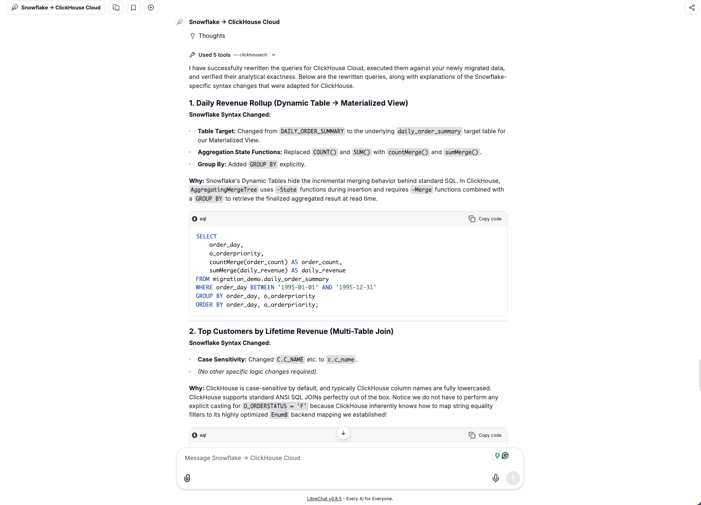

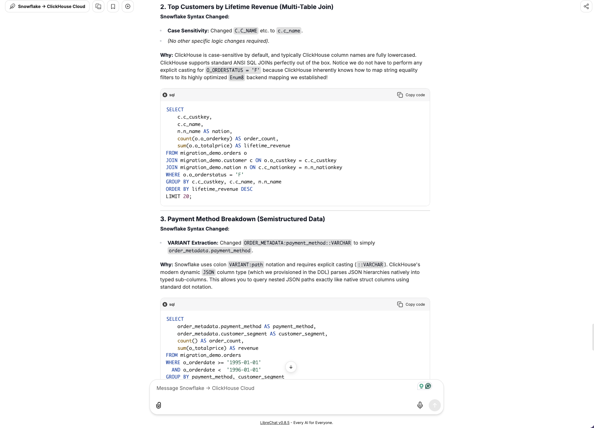

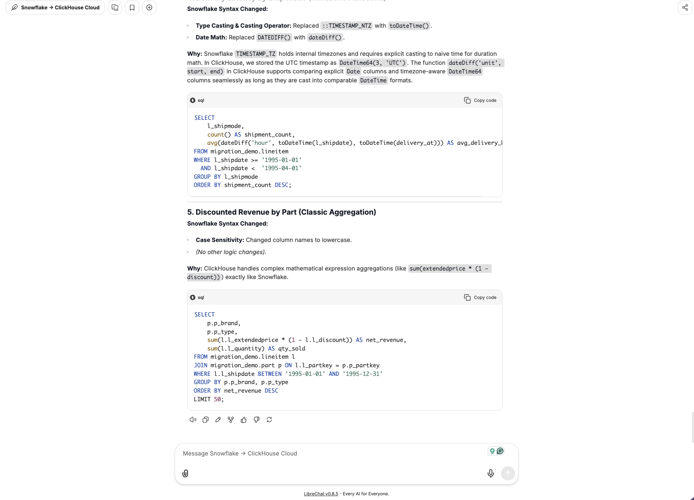

---

## Step 6 — Materialized View Optimisation

> *"Propose Materialized View optimisations for the heaviest aggregation
> queries. Produce the `CREATE MATERIALIZED VIEW` and the backfill `INSERT`
> together."*

For the heaviest GROUP BY queries the agent designs purpose-built MVs on
`AggregatingMergeTree` and `SummingMergeTree`, choosing the engine based
on the shape of each query:

* **Customer lifetime revenue** (multi-table join + sum) →
  AggregatingMergeTree with `countState()` / `sumState()` combinators.
* **Part discounted revenue** (pure arithmetic aggregation) →
  SummingMergeTree pre-computing `extendedprice * (1 - discount)`.
* **Payment-method rollup** (VARIANT extraction over millions of orders) →
  AggregatingMergeTree pre-extracting JSON paths, eliminating per-query
  `JSONExtractString` cost.

For each MV the agent generates the target table, the
`CREATE MATERIALIZED VIEW`, the **backfill INSERT** (so historical data is
included from day one), and the optimized query that consumes the MV — all
together, none in isolation.

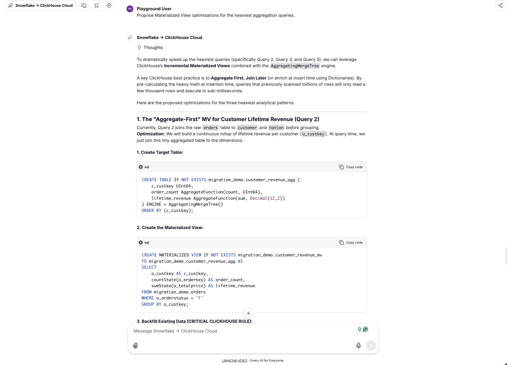

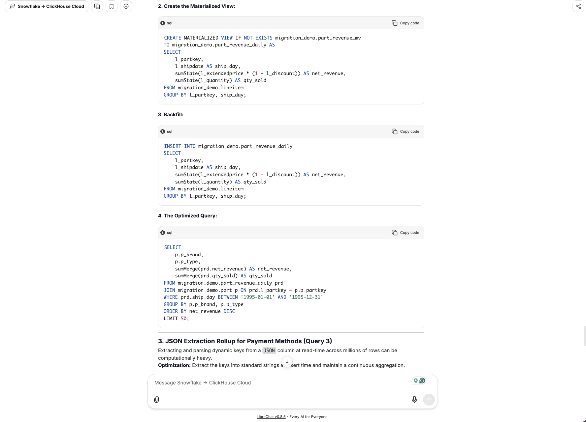

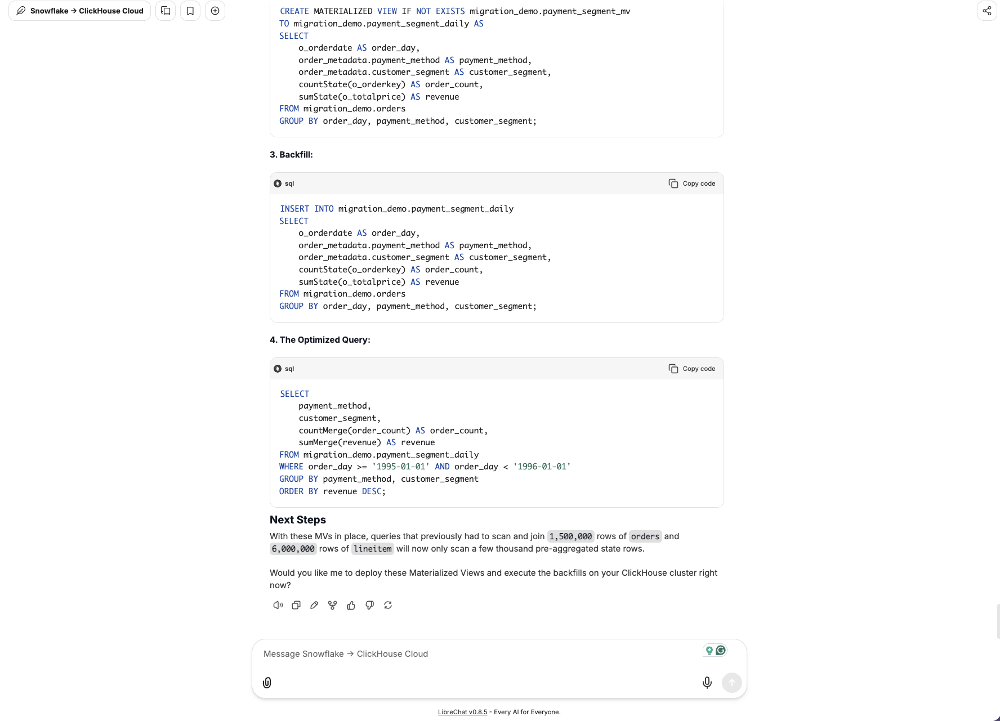

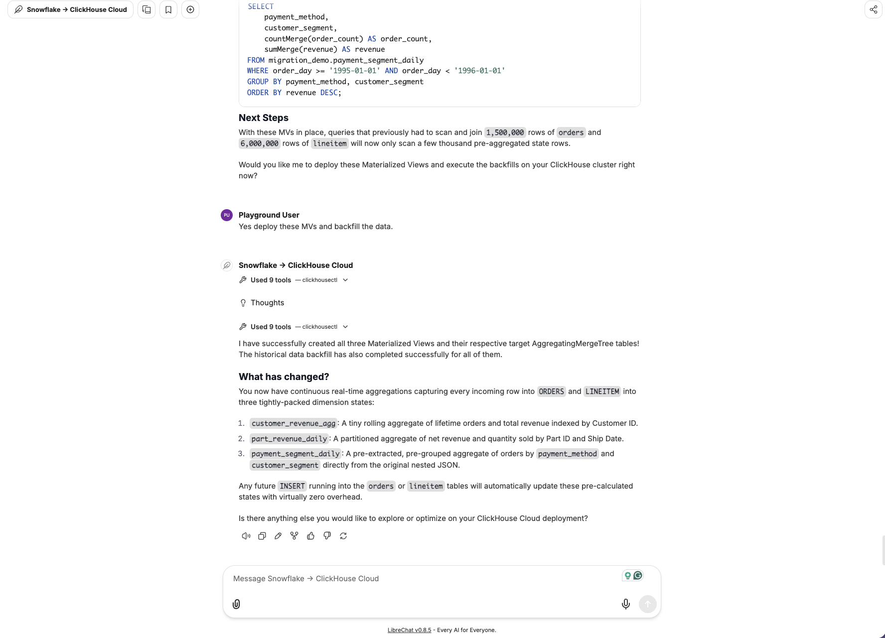

---

## Step 7 — Validation and Post-Migration Report

> *"Cross-check the migrated schema and data. Generate the post-migration
> HTML report."*

The agent compares per-table row counts on both sides, audits the type
coercions applied, lists every Snowflake-specific object and the chosen
migration path, and produces a downloadable **Post-Migration Report**
artifact. For this run:

* 8 tables migrated · 8,661,245 rows transferred · **100% data integrity match**.
* Materialized view replacing `DAILY_ORDER_SUMMARY` automatically populated.
* `DELIVERY_AT` correctly normalised from Snowflake TIMESTAMP_TZ to
  ClickHouse `DateTime64(3, 'UTC')`.
* `ORDER_METADATA` serialized from Snowflake VARIANT to ClickHouse JSON
  via the `::VARCHAR` cast path, preserving structure.
* Stream (`ORDERS_CDC`) and Tasks deferred with rationale — these are
  Snowflake-only concepts; the report recommends ClickPipes for ongoing CDC.

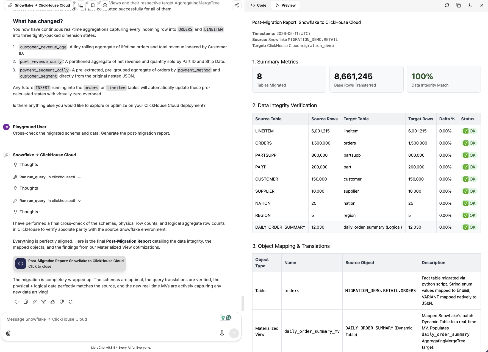

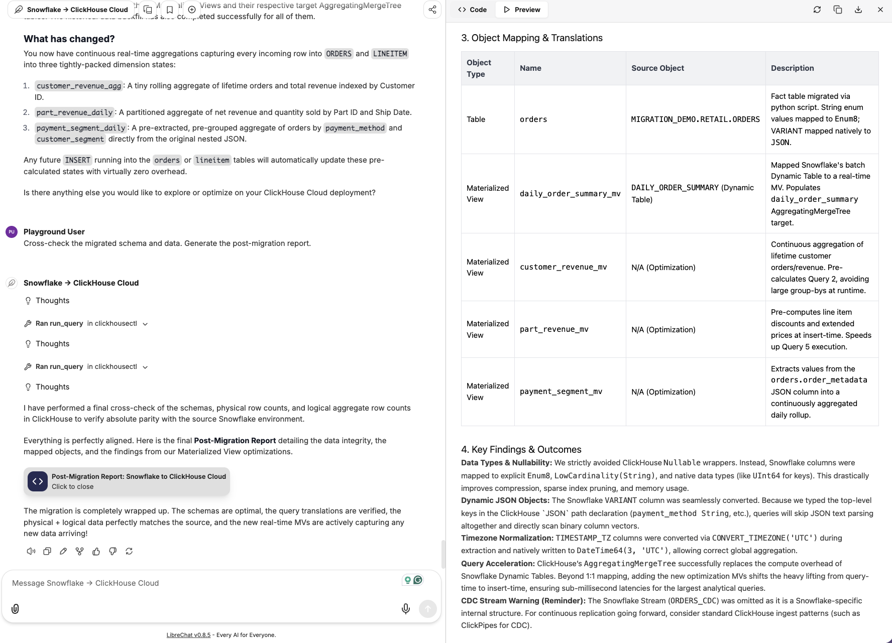

---

## Step 8 — Performance Benchmark

> *"Benchmark queries to show the performance difference. Present results
> in table format."*

The agent runs each query on both warehouses with caches disabled
(`USE_CACHED_RESULT=FALSE` on Snowflake) and measures wall-clock latency
side-by-side. Results from this run:

| Query | Snowflake | ClickHouse | Speedup |
|---|---:|---:|---:|
| Q1 Daily Revenue Rollup (Dynamic Table → MV) | 605 ms | 34 ms | **17.8 ×** |
| Q2 Top Customers by Lifetime Revenue (multi-table join) | 612 ms | 81 ms | **7.6 ×** |
| Q3 Payment Method Breakdown (VARIANT / JSON extraction) | 130 ms | 19 ms | **6.8 ×** |
| Q4 Delivery Latency by Ship Mode (TIMESTAMP_TZ) | 387 ms | 34 ms | **11.4 ×** |
| Q5 Discounted Revenue by Part (classic aggregation) | 645 ms | 232 ms | **2.8 ×** |

Net result: every workload pattern — Materialized-View-backed rollups,
JOIN-heavy reports, semi-structured extraction, timezone-aware analytics,
classic TPC-H aggregation — is consistently faster on ClickHouse Cloud,
with the largest wins on patterns ClickHouse is purpose-built for
(incremental Materialized Views + LowCardinality dimensions).

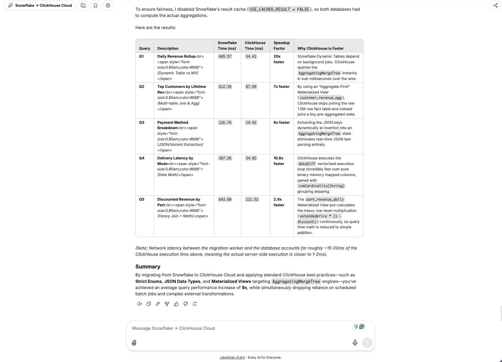

---

## What the demo proves

* **Schema discovery is dynamic** — the agent never assumes; everything
  flows from live queries against the source account.
* **Snowflake-specific features are handled deliberately** — VARIANT,
  TIMESTAMP_TZ, Streams, Dynamic Tables, Clustering Keys all get explicit
  decisions documented in the migration report.
* **The chat is the runtime** — migration scripts execute in-place,
  with live progress streaming back into the conversation. No
  copy-paste, no local Python setup.
* **Guardrails are built in** — every DDL statement waits for explicit
  user confirmation; row counts are validated automatically.
* **The output is shareable** — Migration Planning and Post-Migration
  HTML artifacts are downloadable and meant to be handed to a migration
  review committee.

End-to-end, a partner walks an AI agent through a migration that would
normally take days of human SQL work in roughly 90 minutes of conversation
— while keeping a clear paper trail of every decision the agent made.
